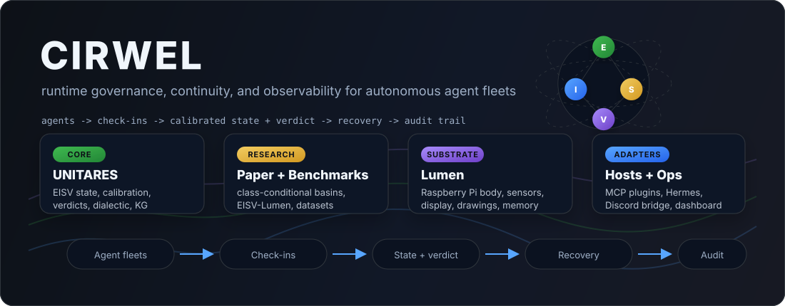

## Kenny Wang — CIRWEL Systems

I build **runtime safety infrastructure for autonomous AI agents** — the layer that operates *after* deployment, while agents are actually running. Agents fail gradually before they fail visibly: drifting, thrashing, growing overconfident on stale context. CIRWEL builds the state layer that lets an agent — and its operator — notice and act on that drift before it becomes an incident.

The stack has run continuously on a single-operator development fleet since **November 2025**. That's a stress test and a telemetry corpus, not a claim of external adoption — external validation is the next step.

### → [**cirwel.github.io**](https://cirwel.github.io) — the full index

Papers, systems, datasets, and decks, all in one place. **That page is canonical**; this profile is just the front door.

---

### The work, in four lines

| | | |
|---|---|---|
| **UNITARES** | Governance runtime — MCP + HTTP, Postgres-backed | Agents check in; it grades drift and calibration against each agent's *own* baseline and returns a verdict (`proceed` / `guide` / `pause` / `reject`) every call. Live since Nov 2025. → [repo](https://github.com/CIRWEL/unitares) |
| **Anima** | The self-sensing counterpart | The same EISV state model on physical hardware (Pi 4, real sensors), turned inward — an edge agent that senses and reports its own interior. The longitudinal source behind the papers. → [anima-mcp](https://github.com/CIRWEL/anima-mcp) |
| **Research** | 3 papers / preprints | Information-theoretic fleet governance ([v6, DOI](https://doi.org/10.5281/zenodo.19647159)) · trajectory identity ([Wang 2026b](https://github.com/CIRWEL/trajectory-identity-paper)) · digital proprioception ([Wang 2026c](https://github.com/CIRWEL/digital-proprioception-paper)). |
| **Datasets** | Published telemetry corpora | [32,181 labeled EISV trajectories](https://huggingface.co/datasets/hikewa/unitares-eisv-trajectories) (20,655 real) · [verdict-counterfactual repro kit](https://github.com/CIRWEL/unitares-repro-v6). |

**Start here:** [`unitares`](https://github.com/CIRWEL/unitares) → `docker compose up -d --wait && make demo` drives a synthetic agent through seven check-ins and prints the verdict at each step.

### For reviewers

- **What this is:** runtime state telemetry for agent fleets *after* deployment — the layer between evals/guardrails and incident response.
- **What this is not:** not an output filter, not a sandbox, not an ethics oracle, and not yet a claim of external adoption.
- **Current ask:** external pilots and [design partners](./docs/design-partners.md) who already run autonomous agents long enough for drift, calibration, and recovery to matter.

---

[Full index ↗](https://cirwel.github.io) · [GitHub](https://github.com/CIRWEL) · [HuggingFace](https://huggingface.co/hikewa) · [ORCID](https://orcid.org/0009-0006-7544-2374) · [CIRWEL Systems](https://cirwel.org) · founder@cirwel.org

